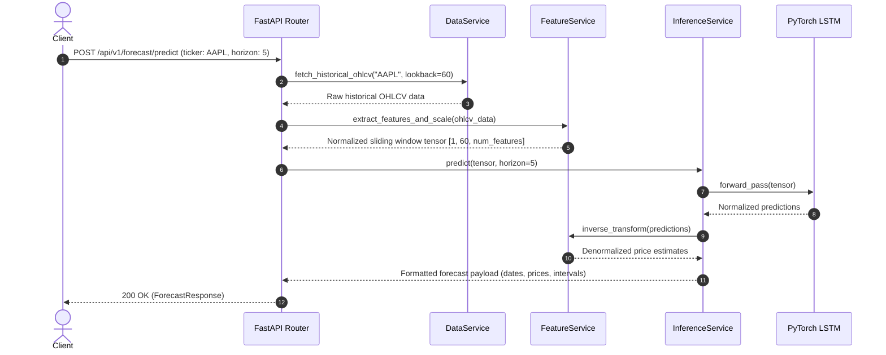

# System Architecture

## Overview
The **LSTM Equity Forecasting** system is an end-to-end quantitative analytics platform designed to ingest historical market price action, engineer time-series technical indicators, and infer prospective equity price trajectories using Long Short-Term Memory (LSTM) recurrent neural network architectures.

---

## High-Level System Architecture

```mermaid
flowchart TD
    subgraph Client ["Frontend Client (React / Vite)"]
        UI[Interactive UI / Dashboard]
        Chart[Candlestick & Forecast Chart]
        Form[Ticker & Horizon Selector]
    end

    subgraph Gateway ["API Gateway / Web Layer (FastAPI)"]
        Router[API Routers]
        Validate[Pydantic Request Validation]
    end

    subgraph Core ["Backend Core Services"]
        DataSvc[Data Ingestion Service]
        FeatSvc[Feature Engineering & Windowing]
        InferSvc[LSTM Inference Service]
    end

    subgraph ML ["Machine Learning Pipeline"]
        Model[PyTorch LSTM Network]
        Scaler[MinMax / Robust Scaler]
        Weights[Model Checkpoints]
    end

    subgraph External ["External Providers & Storage"]
        MarketData[(Market Data APIs: Yahoo Finance / Polygon)]
        DB[(Metadata & Cache Storage)]
    end

    UI --> Form
    UI --> Chart
    Form -->|REST Request| Router
    Router --> Validate
    Validate --> DataSvc
    DataSvc -->|Fetch OHLCV| MarketData
    DataSvc --> DB
    DataSvc --> FeatSvc
    FeatSvc -->|Tensors (batch, seq_len, features)| InferSvc
    InferSvc --> Model
    Model --> Weights
    InferSvc --> Scaler
    InferSvc -->|Predictions & Confidence| Router
    Router -->|JSON Response| UI
```

---

## Architecture Components

### 1. Frontend Layer (`frontend/`)
- **Technology**: React 18+ / TypeScript / Tailwind CSS / Recharts or Lightweight Charts.
- **Responsibilities**:
  - Interactive equity search (ticker, date range, forecast horizon).
  - Dual-mode visualization: Historical price candles and projected future trajectory with confidence bands.
  - Performance indicators display (RMSE, MAE, directional accuracy).

### 2. API & Application Layer (`backend/src/api/`)
- **Technology**: FastAPI (Python 3.12+), ASGI server (Uvicorn).
- **Responsibilities**:
  - RESTful API endpoints for historical data queries, model predictions, and health probes.
  - Strict input validation and serialization using Pydantic v2 schemas.
  - Error handling, rate limiting, and CORS configuration.

### 3. Business Logic & Services (`backend/src/services/`)
- **`data_service.py`**: Fetches historical Open-High-Low-Close-Volume (OHLCV) records, handles missing data imputation, and manages local caching.
- **`feature_service.py`**: Calculates technical indicators:
  - Relative Strength Index (RSI)
  - Moving Average Convergence Divergence (MACD)
  - Exponential Moving Averages (EMA-20, EMA-50)
  - Average True Range (ATR)
  - Normalization using MinMax scalers fit on historical training distributions.
- **`forecast_service.py`**: Prepares rolling window tensors `(B, T, D)`, feeds inputs into the neural network, applies inverse transformations to denormalize predicted values, and computes uncertainty intervals.

### 4. Deep Learning Model (`backend/src/models/lstm.py`)
- **Model Topology**: Multi-layer stacked LSTM network with dropout regularization and a linear projection head.
  - **Input Dimension**: Historical feature vector (Normalized Close, Volume, Returns, RSI, MACD).
  - **Hidden Dimension**: 64–128 hidden units per layer.
  - **Layers**: 2 stacked bidirectional or unidirectional LSTM cells.
  - **Output Dimension**: Multi-step output horizon $H$ (e.g., 5-day or 10-day ahead forecasts).

---

## Data Pipeline & Inference Workflow



---

## Security & Best Practices
- **Environment Isolation**: Secrets, credentials, and API endpoints are loaded via `.env` files using strict Pydantic `BaseSettings`.
- **Stateless Inference**: Scaler states and weights are loaded deterministically; no user-supplied code is executed on the server.
- **CodeRabbit Integration**: Automated code reviews check for parameterized database calls, input validation, and credential leak prevention.

